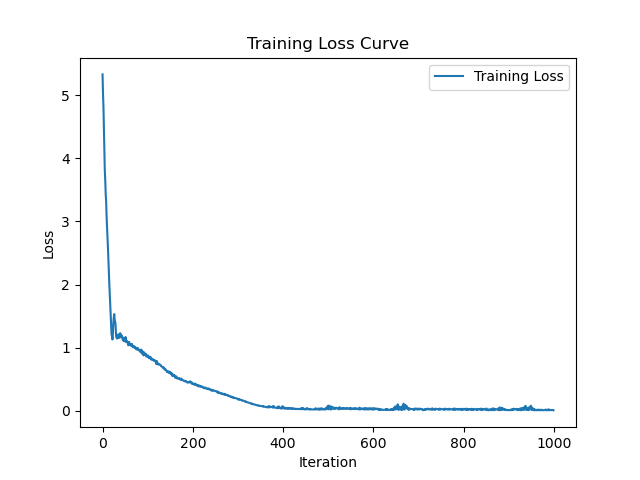
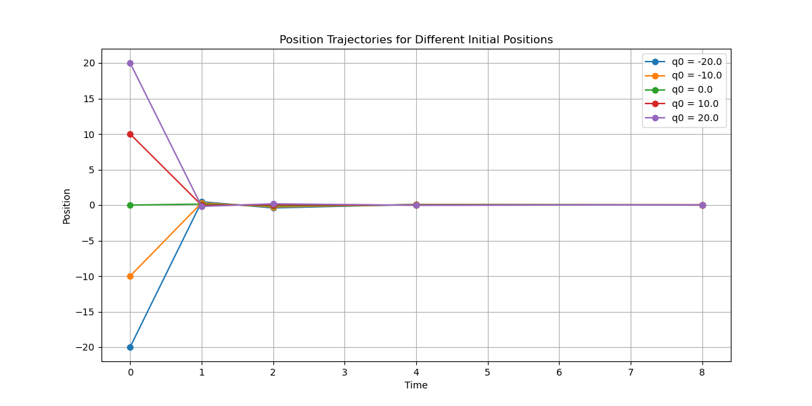
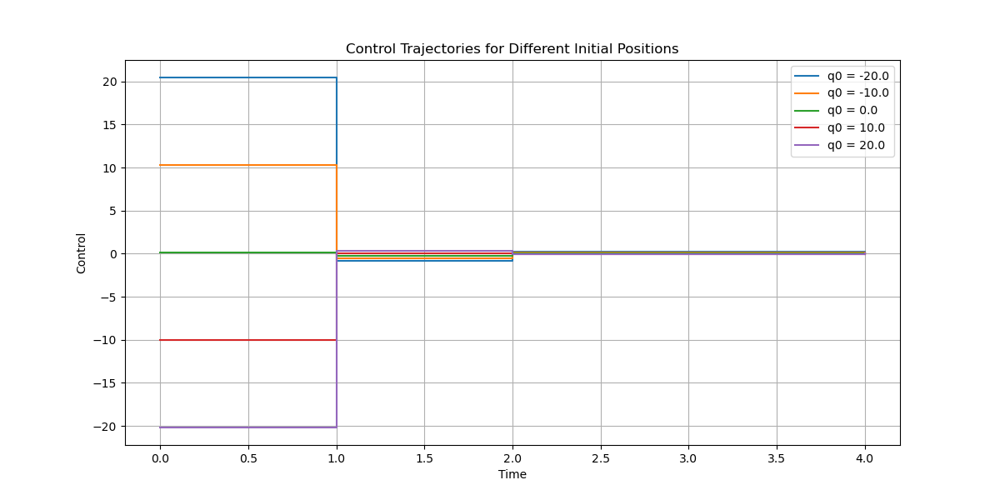

# LQR Optimal Control with Pontryagin Maximum Principle

**Note:** This repository implements concepts discussed in the paper "Physics-informed neural networks via stochastic Hamiltonian dynamics learning" by Chandrajit Bajaj and Minh Nguyen, presented at the Intelligent Systems Conference (2024). You can find the code for the paper [here](https://github.com/mpnguyen2/neural_pmp).

## Table of Contents

- [Introduction](#introduction)
- [Problem Description](#problem-description)
- [Methodology](#methodology)
- [Neural Network Architecture](#neural-network-architecture)
- [Implementation Details](#implementation-details)
- [Results](#results)
  - [Training Loss Curve](#training-loss-curve)
  - [Trajectories](#trajectories)
- [How to Run](#how-to-run)
- [Dependencies](#dependencies)
- [References](#references)

## Introduction

This repository implements a Linear Quadratic Regulator (LQR) problem using a Pontryagin Maximum Principle (PMP)-based approach. The goal is to demonstrate how optimal control can be achieved by training a neural network policy using PMP conditions, specifically for continuous-time control problems discretized over a set of time steps.

## Problem Description

We consider a continuous-time LQR problem where an agent needs to minimize the following cost functional:

$$
J(q, u) = \int_{0}^{T} \frac{1}{2} \left( q(t)^T R q(t) + u(t)^T Q u(t) \right) dt
$$

Subject to the linear dynamics:

$$
\dot{q}(t) = A q(t) + B u(t)
$$

Where:

- $q(t) \in \mathbb{R}$ is the state (position) of the agent at time $t$.
- $u(t) \in \mathbb{R}$ is the control (action) applied at time $t$.
- $R \geq 0$ and $Q \geq 0$ are weighting matrices for the state and control costs, respectively.
- $A$ and $B$ define the system dynamics.

**Specific Parameters for Our Problem:**

- State space $X = \mathbb{R}$
- $A = 0$ (no inherent dynamics)
- $B = 1$ (control directly affects the state)
- $R = 1$ (penalizes deviation from the origin)
- $Q = 0$ (no cost for control effort)

**Objective:** Minimize the cumulative distance of the agent from the origin over the time horizon $[0, T]$, regardless of its initial position $q_0$.

## Methodology

### Pontryagin Maximum Principle (PMP)

The Pontryagin Maximum Principle provides necessary conditions for optimality in control problems. The PMP introduces an adjoint variable $p(t)$ and defines a Hamiltonian $H(q, p, u)$:

$$
H(q, p, u) = p^T (A q + B u) + \frac{1}{2} \left( q^T R q + u^T Q u \right)
$$

The PMP conditions are:

1. **State Dynamics:**
$$\dot{q}(t) = \frac{\partial H}{\partial p} = A q(t) + B u(t)$$

2. **Adjoint Dynamics:**
$$\dot{p}(t) = -\frac{\partial H}{\partial q} = -R q(t) - A^T p(t)$$

3. **Optimal Control:**

$$\frac{\partial H}{\partial u} = 0 \implies B^T p(t) + Q u(t) = 0$$

### Discretization and Neural Network Training

- **Discretization:** We discretize the time horizon into non-uniform time steps $t_0, t_1, ..., t_T$.
- **Neural Network Policy:** A neural network $F_{\theta}$ maps the initial state $q_0$ to a sequence of control actions $u_0, u_1, ..., u_{T-1}$.
- **Loss Function:** We define a loss function based on the PMP condition for optimal control:

$$
L(\theta) = \sum_{k=0}^{T-1} \left\| \frac{\partial H}{\partial u}(q_k, p_k, u_k) \right\|
$$

- **Training Objective:** Minimize $L(\theta)$ to ensure the neural network produces control actions that satisfy the PMP optimality condition.

## Neural Network Architecture

- **Policy Network (`PolicyNetwork`):** A simple feedforward neural network consisting of linear layers for each time step.
  - **Input:** Initial state $q_0$.
  - **Output:** Sequence of control actions $u_0, u_1, ..., u_{T-1}$.
  - **Architecture:**
    - For each time step $k$, a linear layer maps $q_k$ to $u_k$.
    - No activation functions are used since the problem is linear.

**Note:** The network is designed to be as simple as possible due to the linear nature of the LQR problem.

## Implementation Details

- **Programming Language:** Python
- **Libraries:**
  - **PyTorch:** For neural network implementation and automatic differentiation.
  - **NumPy:** For numerical computations.
  - **Matplotlib:** For plotting results.

- **Training Parameters:**
  - **Iterations:** 100
  - **Batch Size:** 1600
  - **Learning Rate:** 0.01

- **Time Steps:** Non-uniform time steps at $t = [0, 1, 2, 4, 8]$.

## Results

### Training Loss Curve

The training loss decreases over iterations, indicating that the neural network is learning to satisfy the PMP optimality condition.



**Interpretation:**

- The loss starts high and gradually decreases, showing convergence.
- The diminishing loss values suggest that the Hamiltonian derivative with respect to control is approaching zero, satisfying the PMP condition.

### Trajectories

We tested the trained policy on multiple initial positions:

- **Initial Positions:** $q_0 = [-20, -10, 0, 10, 20]$

**Position Trajectories:**



**Control Trajectories:**



**Observations:**

- **Positions:**
  - Agents starting away from the origin move towards it rapidly.
  - The agent at $q_0 = 0$ remains at the origin, as expected.
- **Controls:**
  - Initial control actions are significant for agents far from the origin to bring them closer quickly.
  - Control actions reduce over time as agents approach the origin.
  - Agents at the origin apply zero control, maintaining their position.

**Conclusion:**

- The neural network policy effectively generates control actions that minimize the cost functional.
- The trajectories align with the expected optimal behavior for the LQR problem.

## How to Run

1. **Clone the Repository:**

   ```bash
   git@github.com:rfarell/neural_pmp_lqr.git
   cd neural_pmp_lqr
   ```

2. **Install Dependencies:**

   ```bash
   pip install -r requirements.txt
   ```

3. **Run the Main Script:**

   ```bash
   python main.py
   ```

4. **View Results:**

   - Training loss curve and trajectory plots will be saved in the `plots/` directory.
   - The plots will also be displayed during execution.

## Dependencies

- **Python 3.6+**
- **PyTorch**
- **NumPy**
- **Matplotlib**

Install dependencies via `pip`:

```bash
pip install torch numpy matplotlib
```
